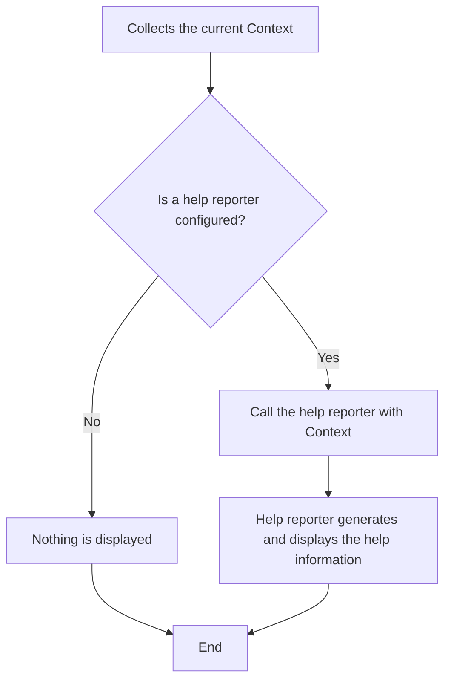

# Help System in Climonad.js

This document explains how Climonad.js's help system works and provides guidance on customizing help messages to improve user experience.

## Table of Contents

- [Introduction](#introduction)
- [Help System Architecture](#help-system-architecture)
- [Customizing Help Output](#customizing-help-output)
- [Help Configuration](#help-configuration)
- [Advanced Customization](#advanced-customization)
- [Best Practices](#best-practices)
- [Examples](#examples)

## Introduction

Effective help messages are crucial for creating user-friendly CLI applications. Climonad's approach is simple: you control exactly what gets displayed when users request help. Unlike frameworks that guess what your help should look like, Climonad puts you in the driver's seat.

The help system in Climonad:

- Gives you complete control over formatting and content
- Can be customized to match your application's style
- Is opt-in—you must explicitly configure it
- Uses a class-based approach to define help behavior

## Help System Architecture

### The CLIHelp Class

The core of Climonad's help system is the `CLIHelp` class, which encapsulates help functionality:

```ts
export class CLIHelp {
  constructor(
    readonly reporter: HelpReporter,
    readonly def: CLIDefinition,
    readonly kind: "command" | "flag" = "flag",
  ) {}
}
```

The `CLIHelp` class takes:

1. A help reporter function that generates the help output
2. A definition for the help command/flag
3. The kind of entry (command or flag) to register for help

### The Help Reporter

The help reporter is a function that receives context about your CLI and is responsible for producing help output:

```ts
type HelpReporter = (ctx: CLIHelpConstructor) => void | Promise<void>

interface CLIHelpConstructor {
  commands: CLIEntry[] // Available commands in current context
  flags: CLIEntry[] // Available flags in current context
  root: CLIEntry // The root entry (usually the main CLI command)
  parent: CLIEntry | null // The parent entry of the current context
}
```

The help reporter is called when:

1. A user explicitly requests help (using the help flag or command)
2. No valid action is found and the CLI needs to show available options

### Help Flow

When help is triggered:



## Customizing Help Output

### Basic Help Reporter

Here's a simple help reporter implementation:

```ts
import { CLIHelpConstructor } from "climonad"

export const helpReporter = ({ commands, flags, root }: CLIHelpConstructor) => {
  console.log(`\n${root.name} - ${root.description}\n`)

  if (commands.length > 0) {
    console.log("Commands:")
    for (const cmd of commands) {
      console.log(`  ${cmd.name}  - ${cmd.description}`)
    }
  }

  if (flags.length > 0) {
    console.log("\nFlags:")
    for (const flag of flags) {
      console.log(`  --${flag.name}  - ${flag.description}`)
    }
  }

  console.log("")
}
```

### Using the Help Reporter

To enable the help system with your custom reporter:

```ts
import { createCLI } from "climonad"
import { helpReporter } from "./help"

export const cli = createCLI({
  name: "example-cli",
  description: "An example CLI application",
  help: true,
  helpReporter,
})
```

## Help Configuration

### Enabling Help

Help is disabled by default. To enable it:

```ts
const cli = createCLI({
  // ...other options
  help: true, // Enable help with default flag name "help"
})
```

### Custom Help Flag

You can specify a custom help flag name:

```ts
const cli = createCLI({
  // ...other options
  help: "assist", // Users can now use --assist to get help
})
```

### Disabling Help

If you don't want to provide help functionality:

```ts
const cli = createCLI({
  // ...other options
  help: false, // Help system is disabled (this is the default)
})
```

## Advanced Customization

### Styled Help Output

You can use terminal styling libraries to enhance your help output:

```ts
import { CLIHelpConstructor } from "climonad"
import chalk from "chalk" // Optional dependency for colors

export const styledHelpReporter = ({ commands, flags, root }: CLIHelpConstructor) => {
  console.log(`\n${chalk.bold(root.name)} - ${root.description}\n`)

  if (commands.length > 0) {
    console.log(chalk.yellow("Commands:"))
    for (const cmd of commands) {
      console.log(`  ${chalk.green(cmd.name)}  - ${cmd.description}`)
    }
  }

  if (flags.length > 0) {
    console.log(`\n${chalk.yellow("Flags:")}`)
    for (const flag of flags) {
      const aliases = flag.aliases?.length ? chalk.gray(`(${flag.aliases.map((a) => `-${a}`).join(", ")})`) : ""
      console.log(`  ${chalk.blue(`--${flag.name}`)} ${aliases}  - ${flag.description}`)

      // Show default values if they exist
      if (flag.default !== undefined) {
        console.log(`    ${chalk.gray(`Default: ${flag.default}`)}`)
      }
    }
  }

  console.log("")
}
```

### Context-Aware Help

You can tailor help information based on the current command context:

```ts
export const contextAwareHelp = ({ commands, flags, root }: CLIHelpConstructor) => {
  if (root.kind === "root") {
    // Top-level help with introduction
    console.log(`\n${root.name} - ${root.description}`)
    console.log("\nA powerful CLI tool for managing your resources.\n")
  } else {
    // Command-specific help with usage examples
    console.log(`\n${root.name} - ${root.description}`)
    console.log(`\nUsage: my-cli ${root.name} [options]\n`)

    // Show command-specific examples
    if (root.name === "create") {
      console.log("Examples:")
      console.log("  my-cli create user --name John")
      console.log("  my-cli create project --name MyProject --type web\n")
    }
  }

  // Display available commands and flags
  // ...
}
```

## Best Practices

### Effective Help Messages

1. **Be concise**: Keep help messages brief but informative
2. **Provide examples**: Show actual usage examples for complex commands
3. **Use consistent formatting**: Maintain a consistent style throughout help output
4. **Group related items**: Organize commands and flags in logical groups
5. **Show defaults**: Indicate default values for optional flags

### User Experience Considerations

- Consider your audience's technical level
- For complex CLIs, consider adding a `--verbose-help` option
- Use color and formatting judiciously to highlight important information
- Include links to more detailed documentation when appropriate
- Ensure help text is readable in all terminal color schemes

## Examples

### Minimal Help for Scripts

```ts
const simpleHelpReporter = ({ commands, flags, root }: CLIHelpConstructor) => {
  console.log(`\nUsage: ${root.name} [options] [command]\n`)

  if (commands.length > 0) {
    console.log("Commands:")
    commands.forEach((cmd) => console.log(`  ${cmd.name}`))
  }

  if (flags.length > 0) {
    console.log("\nFlags:")
    flags.forEach((flag) => console.log(`  --${flag.name}`))
  }

  console.log("\nFor more details, see documentation.")
}
```

### Comprehensive Help for Developer Tools

```ts
const devToolHelpReporter = ({ commands, flags, root }: CLIHelpConstructor) => {
  // Header and description
  console.log(`\n${root.name} v1.0.0 - ${root.description}\n`)

  // Show usage pattern
  const usage = root.kind === "root" ? `${root.name} [options] [command]` : `${root.name} [options]`
  console.log(`Usage: ${usage}\n`)

  // Group commands by category
  if (commands.length > 0) {
    const groups = groupByCategory(commands)
    for (const [category, cmds] of Object.entries(groups)) {
      console.log(`${category} Commands:`)
      for (const cmd of cmds) {
        console.log(`  ${cmd.name.padEnd(15)} ${cmd.description || ""}`)
      }
      console.log("")
    }
  }

  // Show flags with detailed information
  if (flags.length > 0) {
    console.log("Options:")
    for (const flag of flags) {
      const aliases = flag.aliases?.length ? flag.aliases.map((a) => `-${a}`).join(", ") + ", " : ""

      console.log(`  ${aliases}--${flag.name}`.padEnd(20) + (flag.description || ""))

      // Show type, default, and required information
      const details = []
      if (flag.default !== undefined) details.push(`Default: ${flag.default}`)
      if (flag.required) details.push("Required")

      if (details.length > 0) {
        console.log(`    ${details.join(" | ")}`)
      }
    }
  }

  console.log("\nFor more information, see https://example.com/docs")
}

// Helper function to group commands by category
function groupByCategory(commands) {
  // Implementation left as an exercise
  return { General: commands }
}
```

### User-Friendly Consumer Application

```ts
const consumerAppHelpReporter = ({ commands, flags, root }: CLIHelpConstructor) => {
  console.log(`\n👋 Welcome to ${root.name}!\n`)
  console.log(`${root.description}\n`)

  if (commands.length > 0) {
    console.log("🚀 Things you can do:")
    for (const cmd of commands) {
      console.log(`  • ${cmd.name} - ${cmd.description}`)
    }
    console.log("")
  }

  if (flags.length > 0) {
    console.log("🔧 Options you can set:")
    for (const flag of flags) {
      console.log(`  • --${flag.name} - ${flag.description}`)
    }
    console.log("")
  }

  console.log("❓ Need more help? Visit our support site: https://example.com/help")
  console.log("")
}
```
